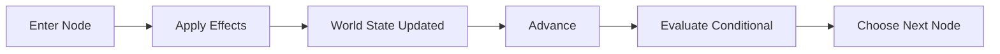
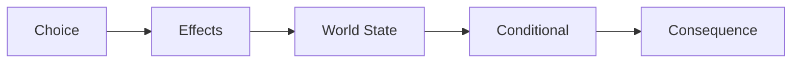

# Causality Foundation

Phase 3A adds generic causality primitives to the Engine without coupling the
Reader to story state.

- `WorldState` stores JSON-safe primitive facts by stable string key.
- Conditions read the current state with strict equality and explicit numeric
  comparisons. `all` and `any` compose conditions recursively.
- Effects return a new state and never mutate their input. They support `set`,
  `increment`, `decrement`, `setFlag`, and `clearFlag`.
- Conditional Story Nodes are invisible routing nodes. The Runtime evaluates
  their branches against the latest state and exposes only renderable nodes to
  the Reader.
- World State numeric values must always be finite. The Runtime and Effect
  Engine reject `NaN`, `Infinity`, and `-Infinity`.
- World State invariants are primitive values only, finite numbers, immutable
  effect application, defensive-copy getters, and no persistence.

The transition order is:

Choice causal commitment extends that order without adding a second mutation
system:

The Runtime calculates the full post-choice state and route before committing
any runtime-owned data. If an effect, target, or routed node fails, World State,
Pending Choice, visible nodes, and Choice History remain unchanged.

World State and Choice History are currently in-memory only. Reader Memory,
cross-reload persistence, and work-specific story concepts remain out of scope.
