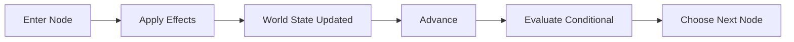
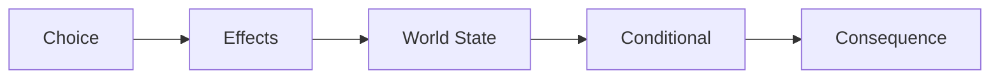

# Causality Foundation

Phase 3A adds generic causality primitives to the Engine without coupling the
Reader to story state.

- `WorldState` stores JSON-safe primitive facts by stable string key.
- Conditions read the current World State with strict equality and explicit
  numeric comparisons. `all` and `any` compose conditions recursively;
  `readerRemembers` explicitly reads the separate Reader Memory.
- Effects return new state and memory values and never mutate their inputs. World
  State effects support `set`, `increment`, `decrement`, `setFlag`, and
  `clearFlag`; the explicit `remember` effect adds one monotonic Reader Memory
  flag without touching World State.
- Conditional Story Nodes are invisible routing nodes. The Runtime evaluates
  their branches against the latest state and exposes only renderable nodes to
  the Reader.
- World State numeric values must always be finite. The Runtime and Effect
  Engine reject `NaN`, `Infinity`, and `-Infinity`.
- World State invariants are primitive values only, finite numbers, immutable
  effect application, defensive-copy getters, and no persistence.

The transition order is:

Choice causal commitment extends that order without adding a second mutation
system:

The Runtime calculates the full post-choice state and route before committing
any runtime-owned data. If an effect, target, or routed node fails, World State,
Pending Choice, visible nodes, and Choice History remain unchanged.

World State, Reader Memory, and Choice History remain separate Engine concepts.
Phase 4A/6A serialize their respective generic persistence envelopes outside the
Engine; Reader UI preferences and work-specific story concepts remain out of
scope.
