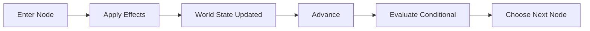

# Causality Foundation

Phase 3A adds generic causality primitives to the Engine without coupling the
Reader to story state.

- `WorldState` stores JSON-safe primitive facts by stable string key.
- Conditions read the current state with strict equality and explicit numeric
  comparisons. `all` and `any` compose conditions recursively.
- Effects return a new state and never mutate their input. They support `set`,
  `increment`, `decrement`, `setFlag`, and `clearFlag`.
- Conditional Story Nodes are invisible routing nodes. The Runtime evaluates
  their branches against the latest state and exposes only renderable nodes to
  the Reader.

The transition order is:

World State is currently in-memory only. Choice, irreversible commit, Reader
Memory, persistence, and work-specific story concepts remain out of scope.
